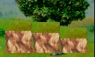

# rumble
Notifies via the USGS earthquake API to your phone when a notable earthquake has hit your subscribed area

### Status
[](https://travis-ci.org/PelkaRepo/rumble)

### Local Test / Build
This system orchestrates build and test using NPM script orchestration.  To install components:

```bash
npm install
```

To test and stage packages for AWS deployment, respectively:
```bash
npm run test
npm run stage
```

### Deployment
This system uses Terraform for AWS deployment orchestration.  To deploy:

```bash
./deploy.sh
# Then apply the subsequent plan, if appropriate:
terraform apply ".terraform/terraform.tfplan"
```

Terraform state is stored remotely.  Current / default configurations are for the upstream bucket.
To use in your own environment, please update the following line of Terraform with the correct
bucket detail:  https://github.com/PelkaRepo/rumble/blob/1786e4ddb84832aa42b6ee191fe685e6ea9a33c4/terraform/lambda/main.tf#L3
